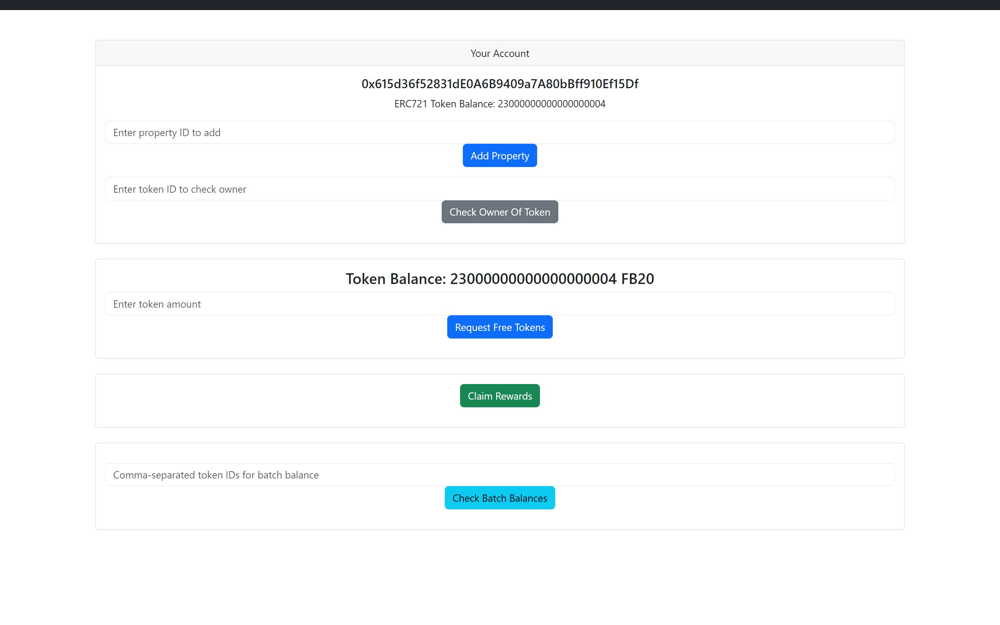
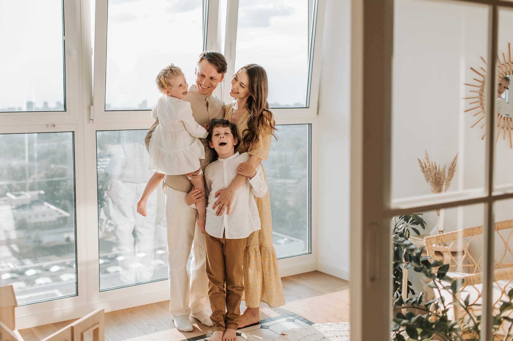
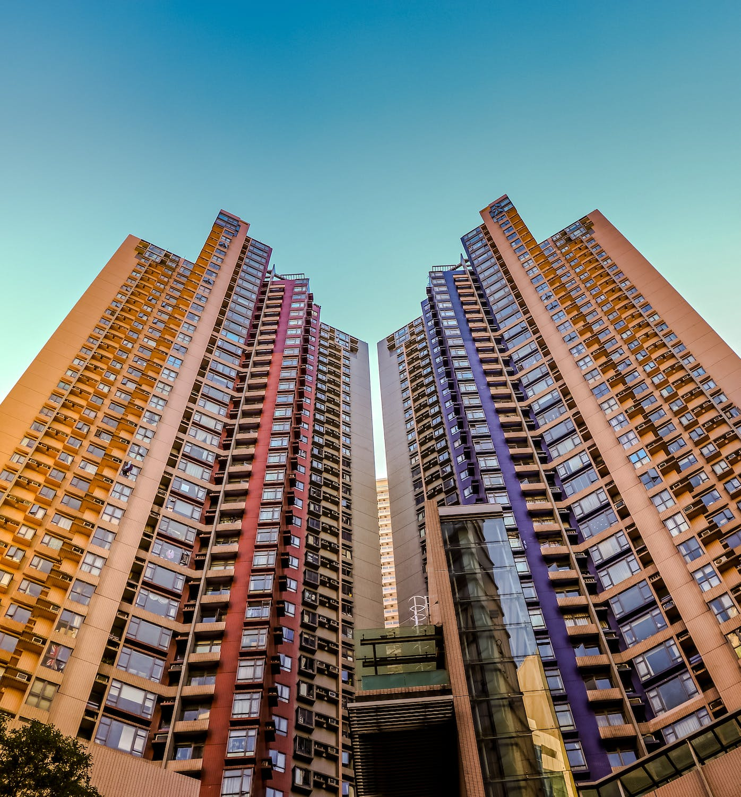
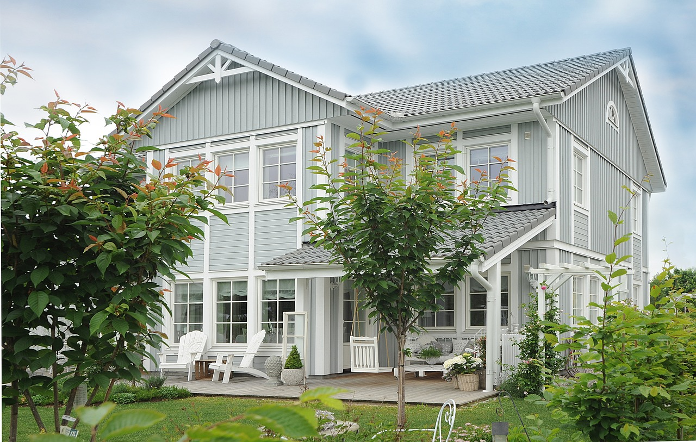

# references:
- https://react-bootstrap.netlify.app/docs/forms/overview/
- https://react-bootstrap.netlify.app/docs/

- https://forum.openzeppelin.com/t/swap-erc20-tokens-from-erc721/19424
- https://docs.openzeppelin.com/contracts/4.x/erc20
- https://docs.openzeppelin.com/contracts/3.x/erc1155
- https://docs.openzeppelin.com/contracts/3.x/erc721

# image: credit to these image websites
After first try of beautifying:

https://unsplash.com/photos/low-angle-photo-of-city-high-rise-buildings-during-daytime-PhYq704ffdA

https://www.pexels.com/photo/happy-affectionate-family-4609033/

https://www.pexels.com/photo/mother-helping-her-baby-girl-sit-on-seesaw-2983461/

https://www.pexels.com/photo/woman-embracing-the-man-1289903/

https://www.pexels.com/photo/two-kids-reading-a-fairy-tale-book-6157226/

https://www.pexels.com/photo/architectural-photography-of-buildings-1481105/

https://pixabay.com/photos/house-window-luxury-lease-3150500/

